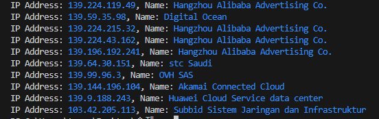

## Overview_IP extractor for Web Servers 
criminal_ip_web_finder is a python script using Criminal IP's banner search api to find which servers leads to which companies and their IP address. 

## What is this for?
This script is for the people who are interested what kind of web server products that companies uses. It shows the public IP address fetched from Criminal IP by typing web server products + show names and ip addresses of the companies that uses the products.

## Requirements
* Must have Criminal IP API key in order to run the script.
* You also need requests module. (And Python... obviously)
(little side note: this is written in python 2.7)

    $ pip install requests

## Run

run `criminal_ip_web_finder.py`
Type in product name of the web server in the console ex: Apache
Type in the number of offset in the console
Type in your Criminal IP api key

## Examples
- 
- 
